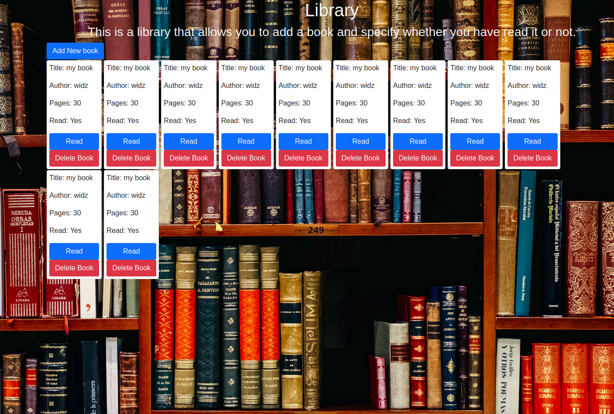

# Library

## Project Description
> This is a small Library web application that allow users to add books to the Library. Added books would have the following information:
- Book Title.
- Author.
- NUmber of pages.
- Read status.
> The book can also be deleted while the read status could be changed through the cick of a button.
- This is basically for educational purposes to better understand the object constructor concept of Javascript.


## Main Page


## Built With
> Javascript.


## Getting Started

To get a local copy up and running follow these simple example steps.

- Go to the "Code" section of this repository and press the green button that says "Code". Copy the URL or the SSH key.
- Go to the terminal and enter:
```
git clone URL/SSH key
```
- If you don't have git, you can download this project and unzip it.
- Change directory into the folder the application is saved.
- Launch the application from index.html.

## Usage
- Click the "Add New Book" button and enter the book's information you wish to add.
- Changed the read status by clicking the "Read" button.
- Click the delete button to remove the book.


## Author


👤 **George Gbenle**

- GitHub: [george-shammar](https://github.com/george-shammar)
- Twitter: [@GeorgeShammar](https://twitter.com/GeorgeShammar)
- LinkedIn: [George Gbenle](https://www.linkedin.com/in/georgegbenle/)
 
👤 **Widzmarc Jean Nesly Phelle**
- Instagram: [widzthedvloper](https://www.instagram.com/widzthedvloper/)
- LInkedin: [widzthedvloper](https://www.linkedin.com/in/widzmarc-jean-nesly-phelle-252a26129/)
- Github: [widzthedvloper](https://github.com/widzthedvloper)


## 🤝 Contributing

Contributions, issues and feature requests are welcome!


## Show your support

Give a ⭐️ if you like this project!


## 📝 License

This project is [MIT](LICENSE) licensed.

## Acknowledgments